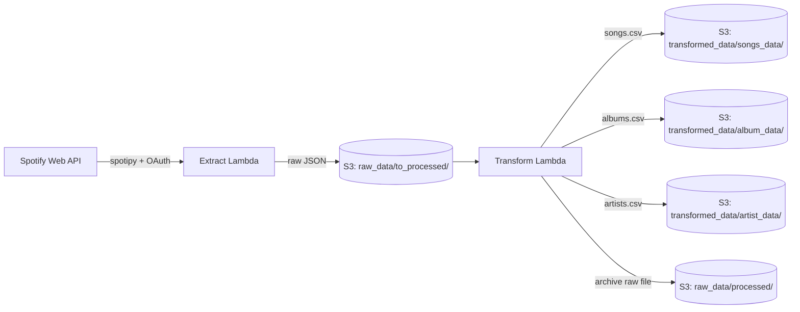
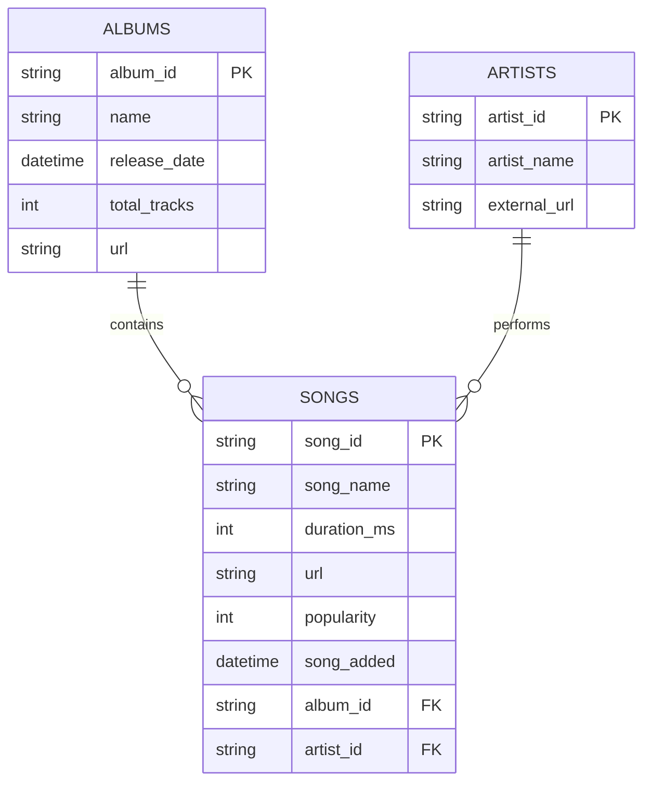

# 🎧 Spotify Playlist ETL Pipeline
### A Serverless AWS Data Engineering Project

> This README doubles as project documentation and interview prep. It explains what the pipeline does, why it's built this way, and includes an honest review of real issues found in the code — so you're ready if an interviewer asks a follow-up question you weren't expecting.


---

## Table of Contents
- [Project at a Glance](#project-at-a-glance)
- [Elevator Pitch](#elevator-pitch)
- [1. The Problem This Solves](#1-the-problem-this-solves)
- [2. Skills This Project Demonstrates](#2-skills-this-project-demonstrates)
- [3. Architecture at a Glance](#3-architecture-at-a-glance)
- [4. Tech Stack and Why](#4-tech-stack-and-why)
- [5. How Each Layer Works](#5-how-each-layer-works)
- [6. Data Model](#6-data-model)
- [7. S3 Folder Structure](#7-s3-folder-structure)
- [8. Deployment Notes](#8-deployment-notes)
- [9. Known Issues and Bugs](#9-known-issues-and-bugs)
- [10. What I'd Improve](#10-what-id-improve)
- [11. Interview Cheat Sheet](#11-interview-cheat-sheet)
- [12. TL;DR Quick Recap](#12-tldr-quick-recap)

---

## Project at a Glance

| | |
|---|---|
| **What it does** | Pulls track data from a Spotify playlist and turns it into clean, analytics-ready tables |
| **Pattern** | Classic ETL (Extract → Transform → Load), fully serverless |
| **Compute** | 3 independent AWS Lambda functions |
| **Storage** | Amazon S3, used as a small data lake |
| **Data source** | Spotify Web API, via the `spotipy` library |
| **Output** | 3 related CSV datasets: `songs`, `albums`, `artists` |
| **Language** | Python |

---

## Elevator Pitch

*(Say this first when an interviewer asks "tell me about a project")*

> "I built a serverless ETL pipeline on AWS that automatically pulls track metadata from a Spotify playlist using Spotify's Web API. It's split into three stages — Extract, Transform, and Load — each running as its own AWS Lambda function. Extract grabs the raw playlist data and drops it into S3 as JSON. Transform reads that JSON, breaks it apart into three clean, related tables — songs, albums, and artists — and writes them back to S3 as CSVs. The design follows a typical data lake pattern: raw data and transformed data live in clearly separated zones, so I can always reprocess from the original source if my transformation logic changes."

---

## 1. The Problem This Solves

Spotify's API doesn't hand you clean data — it hands you one giant, deeply nested JSON object per track, with album info, artist info, and track info all tangled together several levels deep. That's fine for a mobile app to render, but useless for analysis: you can't run SQL against it, chart it, or drop it into a dashboard.

This project's job is to take that mess and automatically turn it into **three flat, related tables** you could open in Excel, load into a database, or query with SQL — on a repeatable schedule, with no manual work.

---

## 2. Skills This Project Demonstrates

- Integrating with a third-party REST API (Spotify Web API) and handling OAuth (Client Credentials flow)
- Serverless architecture design using AWS Lambda
- Data lake design on S3 — raw zone vs. transformed zone, plus file archiving
- Classic ETL pipeline design (Extract → Transform → Load) as separate, single-responsibility jobs
- Data modeling — reshaping nested JSON into fact/dimension-style relational tables
- Python for data engineering: `pandas` for transformation, `boto3` for AWS, `spotipy` for the API
- Working with semi-structured, nested data and flattening it for analytics

---

## 3. Architecture at a Glance



**In plain English:** the Extract Lambda talks to Spotify and drops a raw JSON file into an S3 "inbox." The Transform Lambda picks up everything sitting in that inbox, reshapes it into three clean tables, saves those as CSVs elsewhere in the bucket, and then moves the original raw file into an "already handled" folder so it never gets processed twice.

---

## 4. Tech Stack and Why

| Tool | Role | Why this, in plain terms |
|---|---|---|
| **AWS Lambda** | Compute — "the workers" | Serverless: no server to provision or babysit. AWS only runs (and charges for) the function when it's actually triggered — ideal for short, occasional jobs like this instead of a server running 24/7. |
| **Amazon S3** | Storage — "the data lake" | Cheap, durable, effectively unlimited file storage. The industry-standard place to land both raw and processed data. |
| **spotipy** | Spotify API client | A Python wrapper around Spotify's Web API, so you're not hand-writing raw HTTP calls and OAuth token handling yourself. |
| **boto3** | AWS SDK | The official Python library for talking to AWS services like S3. |
| **pandas** | Data transformation | The standard Python tool for cleaning, reshaping, and deduplicating tabular data. |

---

## 5. How Each Layer Works

### 🟢 Extract Lambda

**In plain English:** logs into Spotify, grabs every track from one specific playlist, and saves that raw response straight into S3, untouched.

**Step by step:**
1. Reads `client_id` / `client_secret` from environment variables — kept out of the code, as secrets should be.
2. Authenticates using the **Client Credentials flow** — an app-level login with no human user signing in. This is the right choice because the goal is public playlist data, not anything tied to a personal account.
3. Takes a hardcoded playlist link and pulls the playlist's unique ID out of the URL.
4. Calls `sp.playlist_tracks(...)` to fetch that playlist's tracks.
5. Uploads the raw JSON response to S3 at `raw_data/to_processed/spotify_raw_<timestamp>.json`.

**Why save raw JSON at all, instead of transforming immediately?** This is a deliberate data lake pattern: keep an untouched copy of the source. If a bug is later found in the transform logic, you can fix it and re-run against the original raw file — you're never dependent on the source data still being available when you realize you need to reprocess it.

### 🟡 Transform Lambda

**In plain English:** reads every not-yet-processed raw JSON file, pulls apart the tangled data into three clean tables (songs, albums, artists), saves each as a CSV, and files away the raw JSON so it isn't reprocessed next time.

**Step by step:**
1. Lists every file under `raw_data/to_processed/` in S3.
2. Reads each `.json` file's content into memory.
3. Runs three helper functions over the data:
   - `album()` — album id, name, release date, track count, URL
   - `artist()` — artist id, name, and link for every artist on every track
   - `songs()` — song id, name, duration, URL, popularity, when added, plus foreign keys back to its album and primary artist
4. Loads each list into a pandas DataFrame (think: an in-memory spreadsheet) and drops duplicate albums/artists — the same album or artist naturally shows up on multiple tracks.
5. Converts date fields (`release_date`, `song_added`) from plain text into real datetime values, so they can be filtered and sorted properly later.
6. Writes all three DataFrames to S3 as timestamped CSVs under `transformed_data/`.
7. "Moves" each processed raw file from `raw_data/to_processed/` to `raw_data/processed/`. S3 has no real "move" operation, so this is done as copy-then-delete — and it's what stops the same file from being picked up and reprocessed on the next run.

### 🔴 Load Lambda

⚠️ **As pasted, this file is byte-for-byte identical to the Transform Lambda** — same helper functions, same logic, same output. There's no separate "load into a destination" step happening yet.

In a complete version of this pattern, **Load** is normally where transformed data gets pushed into something query-friendly, for example:
- Registered with an **AWS Glue Crawler** so it's queryable via **Athena** using plain SQL, or
- Loaded into a warehouse like **Redshift**, or a database table.

**Action item:** replace this file's content with your actual load logic — or, if the project intentionally stops at "transformed CSVs sitting in S3," rename this stage so the README (and your interview answer) match what's actually deployed.

---

## 6. Data Model

Think of `songs` as the **fact table** (the thing you're measuring) and `albums` / `artists` as **dimension tables** (the descriptive context around it) — a simplified star schema.



**`songs`**

| Column | Type | Notes |
|---|---|---|
| song_id | string | Spotify's unique track ID |
| song_name | string | Track title |
| duration_ms | integer | Length in milliseconds |
| url | string | Shareable Spotify link |
| popularity | integer (0–100) | Spotify's popularity score — *currently broken in code, see Known Issues* |
| song_added | datetime | When the track was added to the playlist |
| album_id | string | Foreign key → `albums` |
| artist_id | string | Foreign key → `artists` (primary artist only) |

**`albums`**

| Column | Type | Notes |
|---|---|---|
| album_id | string | Spotify's unique album ID |
| name | string | Album title |
| release_date | datetime | Release date |
| total_tracks | integer | Track count on the album |
| url | string | Shareable Spotify link |

**`artists`**

| Column | Type | Notes |
|---|---|---|
| artist_id | string | Spotify's unique artist ID |
| artist_name | string | Artist's name |
| external_url | string | *Currently the Spotify API URL, not a shareable web link — see Known Issues* |

---

## 7. S3 Folder Structure

```text
s3://<your-bucket>/
├── raw_data/
│   ├── to_processed/     ← new raw JSON lands here (Extract writes here)
│   └── processed/        ← archived after Transform runs, so nothing gets processed twice
└── transformed_data/
    ├── songs_data/        ← songs_transformed_<timestamp>.csv
    ├── album_data/        ← album_transformed_<timestamp>.csv
    └── artist_data/       ← artist_transformed_<timestamp>.csv
```

This raw-vs-transformed split is a small-scale version of what's often called **raw/bronze** and **curated/silver** zones in data lake design.

---

## 8. Deployment Notes

*(Typical setup for this kind of pipeline — worth confirming these match what you actually have configured in AWS.)*

- **Trigger:** Extract Lambda is normally run on a schedule via **Amazon EventBridge** (e.g., daily). Transform/Load can run on their own schedule too, or — better — be triggered automatically by an **S3 event notification** the moment Extract drops a new file.
- **IAM role:** each Lambda needs permission to read/write/delete/copy the relevant S3 paths, plus basic CloudWatch Logs access.
- **Secrets:** `client_id` / `client_secret` are read from Lambda environment variables — fine for a portfolio project; production setups typically use **AWS Secrets Manager** instead.
- **Dependencies:** `boto3` ships with the Lambda Python runtime by default. `pandas` and `spotipy` do **not** — both need to be added via a **Lambda Layer** or bundled into the deployment package.

---

## 9. Known Issues and Bugs

Being able to calmly talk through real bugs — with a fix already in mind — is a strong interview signal. Here's what a close read of this pipeline turns up:

**Would actually break the code today:**

1. **`row['item']` vs. `row['track']`** — `album()` and `songs()` read each track from `row['item']`, but Spotify's actual API response nests it under `row['track']`. This raises a `KeyError`. (`artist()` already does it correctly, using `row['track']`.)
   ```python
   # Current (breaks):
   album_id = row['item']['album']['id']

   # Should be:
   album_id = row['track']['album']['id']
   ```
2. **Undefined variable** — `songs()` references `song_popularity`, which is never defined anywhere in the function. It's almost certainly meant to be `row['track']['popularity']`.
3. **Bucket name mismatch** — Extract writes to `spotify-etl-project-darshil`, but Transform/Load read from `spotify-etl-project-rupesh`. Two different buckets, so nothing Extract writes would ever be picked up downstream. Both need to point at the same bucket.

**Design gaps** *(fine for a learning project, worth being able to name out loud):*

4. **Load stage isn't really implemented** — it's currently a duplicate of Transform, with no real "load into a queryable destination" step.
5. **No pagination on the Spotify call** — `sp.playlist_tracks()` returns at most 100 tracks per call. Any playlist over 100 tracks would be silently truncated; there's no loop using the API's `next` page.
6. **No pagination on the S3 listing either** — `list_objects()` caps at 1,000 keys per call, and is also the older, soft-deprecated API (`list_objects_v2` is the modern equivalent).
7. **Every run re-extracts the full playlist**, and Transform doesn't merge or deduplicate across separate runs — so over time you'd accumulate multiple overlapping CSVs instead of one clean, up-to-date table. A production version would need either incremental extraction or a downstream merge/upsert step.
8. **One artist per song** — `artist_id` is pulled from `album['artists'][0]`, i.e. only the primary artist. Songs with multiple or featured artists aren't fully modeled; a proper schema would need a `song_artist` bridge table.
9. **No error handling** — a single unexpected item (e.g., a local file or podcast episode sitting in the playlist, which has a different data shape) would crash the whole batch.
10. **Unused API call** — `playlists = sp.user_playlists('spotify')` is fetched but never used anywhere.

**Minor / cosmetic:**

11. Typos (`cilent_id`, `cilent` for the S3 client) — harmless since used consistently, but worth a cleanup pass.
12. `artist()`'s `external_url` field actually stores `artist['href']` — the Spotify **API** endpoint — not `artist['external_urls']['spotify']`, the shareable web link used everywhere else. Inconsistent with how `url` is built for songs and albums.
13. `song_df` isn't deduplicated by `song_id`, while `album_df` and `artist_df` are deduplicated. If the same track ever appears twice in the playlist, you'd get duplicate rows.

---

## 10. What I'd Improve

- Orchestrate the three stages with **Step Functions**, or trigger Transform directly off an S3 event instead of a separate schedule
- Store transformed output as **Parquet** instead of CSV — smaller, faster, and the standard format for analytics engines
- Add a **Glue Crawler + Athena** so the data is queryable with plain SQL
- Parametrize the playlist ID and bucket name instead of hardcoding, so the same pipeline could ingest any playlist
- Add unit tests for `album()`, `artist()`, and `songs()` — they're pure functions, easy to test against a saved sample JSON response
- Add data quality checks before writing output (e.g., no null `song_id`, no duplicate rows)
- Add CloudWatch Alarms / SNS notifications on failure
- Manage infrastructure with Terraform, AWS SAM, or CDK instead of manual console setup
- Move secrets to Secrets Manager

---

## 11. Interview Cheat Sheet

**"Walk me through this project."**
→ Use the elevator pitch above, then be ready to go one level deeper into whichever stage they poke at.

**"Why three separate Lambda functions instead of one script?"**
→ Separation of concerns — each stage has one job and can be tested, debugged, and redeployed independently. If Transform fails, Extract isn't affected, and you're not re-running work that already succeeded.

**"Why S3 for the raw data instead of transforming immediately?"**
→ Keeping raw data as an untouched, permanent copy means you can always re-run your transform logic later — including after fixing a bug — without needing to re-call the Spotify API. It's a standard "raw zone" data lake pattern.

**"What's the Client Credentials OAuth flow, and why use it here?"**
→ It's app-level authentication — no individual user logs in. It fits because this pipeline only needs public data (a playlist's tracks/albums/artists), not anything tied to a specific person's account. The Authorization Code flow would be needed if the project touched private, user-specific data instead.

**"How do you handle duplicate data across pipeline runs?"**
→ Honest answer: right now it doesn't fully. Every run re-extracts the whole playlist, and Transform writes a fresh CSV each time without merging against previous runs. Next step would be incremental extraction (using each track's `added_at`) or a downstream upsert step keyed on `song_id`.

**"How would you scale this to a much bigger playlist, or someone's whole library?"**
→ Add pagination for both the Spotify call (only 100 tracks per request today) and the S3 listing, parametrize the playlist ID, and consider batching or parallelizing the Transform step.

**"What would you change if this went to production?"**
→ Point to the Roadmap: Parquet instead of CSV, Glue + Athena for querying, Step Functions for orchestration, infrastructure as code, and proper monitoring/alerting.

**"Tell me about a bug you found in your own code."**
→ Great one to have ready: the `row['item']` vs. `row['track']` mismatch is a real, concrete example. Explain what the actual Spotify API response looks like, why the original code didn't match it, and how you'd confirm the fix — a quick unit test against a saved sample response.

---

## 12. TL;DR Quick Recap

- **What:** Serverless ETL pipeline that turns a Spotify playlist into 3 clean CSV tables.
- **How:** 3 AWS Lambda functions (Extract → Transform → Load) + S3 as the data lake.
- **Extract:** Spotify API → raw JSON → S3.
- **Transform:** raw JSON → 3 pandas DataFrames → CSVs in S3, raw file archived.
- **Load:** currently a placeholder — the real destination (Athena/warehouse) isn't built yet.
- **Known bugs:** `row['item']` should be `row['track']`, `song_popularity` is undefined, and the bucket name doesn't match between layers.
- **Best interview flex:** you can name the bugs, explain *why* they happen, and describe exactly how you'd fix and scale the pipeline.

---

*Built as a hands-on data engineering portfolio project.*
