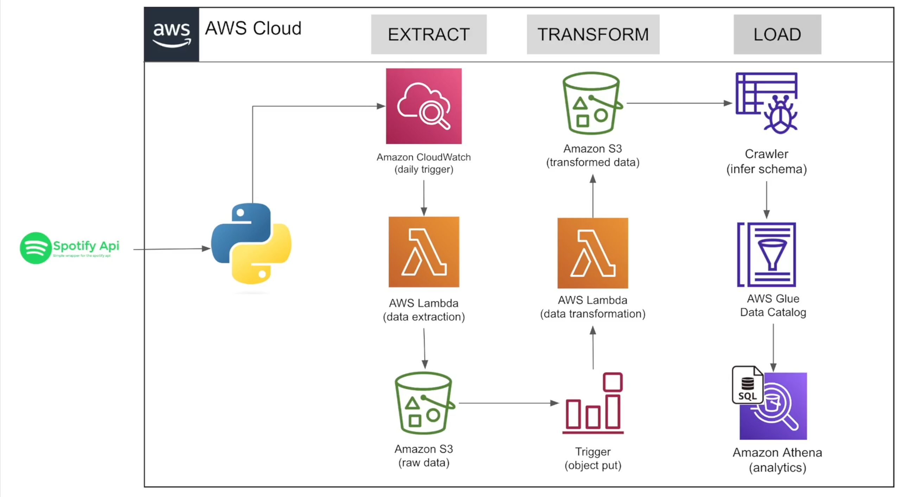

# 🎧 Spotify Serverless ETL Pipeline (AWS Lambda + S3)

An automated, serverless data pipeline that pulls playlist data from the **Spotify Web API**, transforms it into clean relational tables, and loads it into **Amazon S3** as analytics-ready CSV files — with zero servers to manage.

---

## 📌 What This Project Does

This pipeline answers a simple question: *"How do I turn a raw Spotify playlist into structured, queryable data — automatically, on a schedule, without managing infrastructure?"*

It does this in three stages:

1. **Extract** — Pulls raw track/album/artist metadata from a Spotify playlist via the Spotify API and drops it into S3 as raw JSON.
2. **Transform** — Parses the raw JSON into three clean, normalized datasets: **Songs**, **Albums**, and **Artists**.
3. **Load** — Writes the transformed data back to S3 as CSVs, ready for downstream use (e.g. Athena, Redshift, QuickSight, or a BI tool), and archives the raw file so it isn't reprocessed.

---

## 🏗️ Architecture



| Stage | AWS Service | What Happens |
|---|---|---|
| Trigger | Amazon CloudWatch (daily) | Fires on a schedule and invokes the Extract Lambda |
| Extract | AWS Lambda (`extract.py`) | Pulls playlist data from the Spotify API via `spotipy` and writes raw JSON to S3 |
| Storage (raw) | Amazon S3 | Holds the raw JSON |
| Trigger | S3 Event (Object Put) | New raw file automatically invokes the Transform Lambda |
| Transform & Load | AWS Lambda (`transform.py` / `load.py`) | Parses the JSON into Songs, Albums, and Artists tables and writes CSVs back to S3 |
| Storage (transformed) | Amazon S3 | Holds the clean, structured CSVs |
| Schema Discovery | AWS Glue Crawler | Scans the transformed data and infers its schema |
| Cataloging | AWS Glue Data Catalog | Registers the inferred schema as queryable tables |
| Analytics | Amazon Athena | Lets you run SQL directly over the S3 data using the Glue Catalog |

The pipeline is entirely serverless: **Lambda** does the compute, **S3** is both the data lake and the trigger mechanism between stages, and **Glue + Athena** turn the output into something queryable — no servers, and no dedicated orchestration tool needed.

---

## 🛠️ Tech Stack

| Layer | Technology |
|---|---|
| Language | Python 3 |
| Compute | AWS Lambda (serverless) |
| Scheduling | Amazon CloudWatch (daily trigger) |
| Storage | Amazon S3 (data lake — raw + transformed) |
| Data Source | Spotify Web API (via `spotipy`) |
| Data Processing | `pandas` |
| AWS SDK | `boto3` |
| Schema & Cataloging | AWS Glue (Crawler + Data Catalog) |
| Analytics / Query | Amazon Athena |

---

## 📂 Project Structure

```
├── extract.py     # Stage 1: Pulls playlist data from Spotify → raw JSON in S3
├── transform.py   # Stage 2: Transforms raw JSON → structured CSVs in S3
├── load.py        # Stage 2 (alt): Same transform/load logic as transform.py
└── README.md
```

**S3 Bucket Layout**

```
spotify-etl-project/
├── raw_data/
│   ├── to_processed/     # Incoming raw JSON from the Extract stage
│   └── processed/        # Archived JSON after it's been transformed
└── transformed_data/
    ├── songs_data/        # songs_transformed_<timestamp>.csv
    ├── album_data/         # album_transformed_<timestamp>.csv
    └── artist_data/        # artist_transformed_<timestamp>.csv
```

---

## 🔍 How It Works

### 1. Extract (`extract.py`)
- Authenticates with the Spotify API using client credentials (`SpotifyClientCredentials`).
- Fetches all tracks from a target playlist via `sp.playlist_tracks()`.
- Writes the raw response as a timestamped JSON file to `raw_data/to_processed/` in S3.

### 2. Transform & Load (`transform.py` / `load.py`)
- Scans `raw_data/to_processed/` for new JSON files.
- Parses each file into three separate record sets:
  - **Albums** — id, name, release date, total tracks, Spotify URL
  - **Artists** — id, name, external URL (deduplicated)
  - **Songs** — id, name, duration, URL, date added, linked album & artist IDs
- Loads each set into a `pandas` DataFrame, cleans types (e.g. parses dates), and removes duplicates.
- Writes each DataFrame to S3 as a CSV under `transformed_data/`.
- Moves the source JSON from `raw_data/to_processed/` to `raw_data/processed/` so it isn't picked up again.

### 3. Catalog (AWS Glue)
- A **Glue Crawler** scans the CSVs in `transformed_data/` and infers their schema.
- The inferred schema is registered in the **AWS Glue Data Catalog** as queryable tables.

### 4. Analyze (Amazon Athena)
- With the tables cataloged, **Athena** can run standard SQL directly against the S3 data — no data movement or warehouse required.

---

## 📊 Output Data Model

**Albums**
| album_id | name | release_date | total_tracks | url |
|---|---|---|---|---|

**Artists**
| artist_id | artist_name | external_url |
|---|---|---|

**Songs**
| song_id | song_name | duration_ms | url | popularity | song_added | album_id | artist_id |
|---|---|---|---|---|---|---|---|

These three tables are linked by `album_id` and `artist_id`, forming a simple star-style schema ready for querying in a tool like Athena or loading into a warehouse.

---

## ⚙️ Setup & Deployment

1. **Create a Spotify app** at the [Spotify Developer Dashboard](https://developer.spotify.com/dashboard) to get a `client_id` and `client_secret`.
2. **Create an S3 bucket** with the folder structure shown above.
3. **Set environment variables** on the Extract Lambda:
   - `client_id`
   - `client_secret`
4. **Package dependencies**: `spotipy` and `boto3` can ship in the deployment package; `pandas` typically requires an [AWS Lambda layer](https://docs.aws.amazon.com/lambda/latest/dg/configuration-layers.html) since it exceeds the inline package size limit.
5. **Deploy `extract.py`** as a Lambda function, triggered daily by an **Amazon CloudWatch** scheduled rule.
6. **Deploy `transform.py`/`load.py`** as a second Lambda function, triggered by an **S3 event notification** (`ObjectPut`) whenever a new file lands in `raw_data/to_processed/`.
7. **Grant IAM permissions**: both Lambdas need `s3:GetObject`, `s3:PutObject`, `s3:DeleteObject`, and `s3:ListBucket` on the target bucket.
8. **Create an AWS Glue Crawler** pointed at `transformed_data/` to infer the schema and populate the **Glue Data Catalog**.
9. **Query the data in Amazon Athena** using the tables registered by the crawler — no additional loading step required.

---

## 🚀 Future Improvements

- Consolidate `transform.py` and `load.py`, which currently contain duplicate logic, into a single stage.
- Add structured logging and error handling (e.g. retries, dead-letter queue for failed files).
- Add unit tests for the `album()`, `artist()`, and `songs()` parsing functions.
- Wire the transformed CSVs into a downstream analytics layer (Athena + QuickSight, or a Redshift load) for visualization.
- Parameterize the target playlist and bucket name instead of hardcoding them.

---

## 👤 Author

**Rupesh Saw**
[GitHub](https://github.com/rupeshsaw1998) · [LinkedIn](https://linkedin.com/in/rupeshsaw/)
